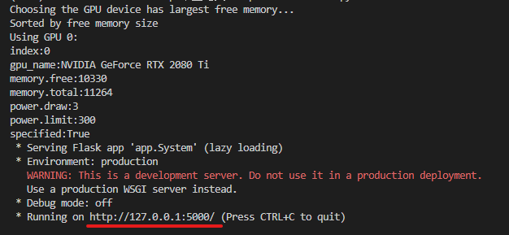

# ATEPC

## 介绍
毕业设计，方面级情感分析模型。可以提取一句话中多个方面词和其对应的情感。

## 安装教程

分别运行`APC_train.py`和`ATE_train.py`便可训练两个模型。

在运行上面两个文件后，会在`.\logs`文件夹中看到训练结果。

可以将评论按行写入`comment.txt`文件，或者放入web界面的文本框中。

运行`run.py`，打开网址便可看到界面，按照界面提示操作即可。

## 使用说明

运行`APC_train_SDR.py`可以看到语义相对距离对模型的影响，结果在`.\logs`文件夹中。

修改`json`文件可以更改模型参数。

`.\atepc_datasets`文件夹中是训练数据和测试数据。

`.\output`保存训练好的模型。

只有运行之后才会出现`.\output`和`.\logs`文件夹。

## 模型大小

`trainedAPC.pt`和`trainedATE.pt`分别为800MB和778MB，注意磁盘空间。

# 分支

## APC无共享参数模型

将APC模型(情感极性分类模型)中对local模型和global模型的共享参数去掉，可以提高一点点准确度和$f_1$分数，但是模型大小从800MB上升到1.2G。